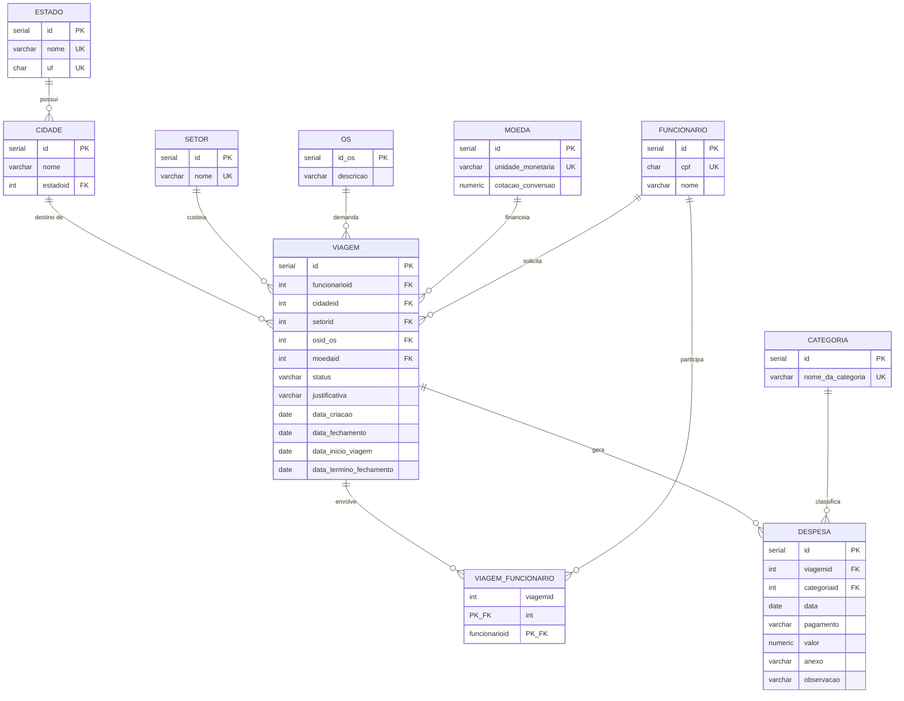

# Sistema de Controle de Viagens Corporativas — ControlTrip

> Trabalho Final A1 — Banco de Dados I | Ciência da Computação | UNOESC São Miguel do Oeste — 2026/01
> Professor: Roberson Junior Fernandes Alves

---

## Resumo

O **ControlTrip** é um sistema de gerenciamento e controle de deslocamentos corporativos e Relatórios de Despesas de Viagem (RDV). Desenvolvido para facilitar a prestação de contas de colaboradores em trânsito, o sistema modela o fluxo completo de uma viagem corporativa: desde o planejamento inicial vinculado a um projeto (Ordem de Serviço) até o acerto final de contas, com o lançamento de despesas individuais (hospedagem, alimentação, transporte) em diversas moedas e a respectiva conversão cambial.

A modelagem de dados foi rigorosamente projetada seguindo as regras de normalização até a **Terceira Forma Normal (3FN)**, garantindo a integridade dos dados, ausência de redundâncias e alta rastreabilidade fiscal para auditorias corporativas.

---

## Requisitos Funcionais

| ID | Descrição |
|----|-----------|
| RF01 | O sistema deve permitir o cadastro de funcionários com nome completo e CPF único. |
| RF02 | O sistema deve gerenciar os setores organizacionais que respondem como centros de custos. |
| RF03 | O sistema deve permitir o cadastro geográfico de Estados e Cidades associadas. |
| RF04 | O sistema deve cadastrar Ordens de Serviço (OS) vinculadas a projetos comerciais ou de infraestrutura. |
| RF05 | O sistema deve permitir classificar despesas por Categorias contábeis (ex: Alimentação, Hospedagem). |
| RF06 | O sistema deve gerenciar moedas estrangeiras e suas respectivas taxas de conversão de câmbio para BRL. |
| RF07 | O sistema deve registrar solicitações de viagem vinculando o funcionário responsável, destino, setor, OS e moeda de acerto. |
| RF08 | O sistema deve gerenciar o workflow das viagens através dos status: `RASCUNHO`, `PENDENTE`, `APROVADO`, `REJEITADO` e `CONCLUIDO`. |
| RF09 | O sistema deve registrar múltiplos funcionários que compartilham o mesmo deslocamento (relação N:M). |
| RF10 | O sistema deve registrar lançamentos individuais de despesas informando valor, data, forma de pagamento, anexo digitalizado e observação. |
| RF11 | O sistema deve permitir o cálculo automático do custo total acumulado de uma viagem. |
| RF12 | O sistema deve realizar a conversão cambial dinâmica com base na taxa histórica de conversão registrada para a moeda. |
| RF13 | O sistema deve emitir relatório consolidado de despesas totais por viagem com conversão de câmbio para BRL. |
| RF14 | O sistema deve listar as viagens por funcionário e setor para acompanhamento gerencial. |
| RF15 | O sistema deve gerar relatórios de faturamento e representatividade de custos por categoria de despesa. |
| RF16 | O sistema deve consolidar o andamento e quantidade de viagens ativas e concluídas agrupadas por Ordem de Serviço (OS). |
| RF17 | O sistema deve emitir relatório de despesas agrupado mensalmente por período e moeda. |

---

## Requisitos Não Funcionais

| ID | Descrição |
|----|-----------|
| RNF01 | O banco de dados deve ser implementado no **PostgreSQL** (versão 14 ou superior). |
| RNF02 | O modelo relacional deve estar normalizado até a **3FN** (Terceira Forma Normal). |
| RNF03 | Todos os campos obrigatórios e chaves estrangeiras devem ser protegidos com restrições `NOT NULL`. |
| RNF04 | O CPF de funcionários deve conter exatamente 11 caracteres numéricos, validados via expressão regular (`CHECK`). |
| RNF05 | Valores de despesas e cotações cambiais devem usar precisão decimal fixa via tipo `NUMERIC`. |
| RNF06 | A data de término de fechamento da viagem deve ser igual ou superior à data de início da viagem (via `CHECK`). |
| RNF07 | A data de fechamento do prazo da viagem deve ser igual ou superior à data de criação do registro (via `CHECK`). |
| RNF08 | Os status de viagens e formas de pagamento permitidas devem ser validados via cláusula `CHECK`. |
| RNF09 | Exclusões de registros pai críticos (como funcionários e moedas) devem ser impedidas se houver registros filhos vinculados (`RESTRICT`). |
| RNF10 | Exclusões de viagens devem ser propagadas em cascata (`CASCADE`) para limpar os dados de despesas e tabelas associativas relacionadas. |
| RNF11 | Índices de performance devem ser aplicados a chaves estrangeiras, colunas de status e campos de busca por período para otimização de junções. |

---

## Diagrama Entidade-Relacionamento



> O modelo lógico relacional detalhado com justificativas de normalização está em [`docs/diagrama-relacional.md`](docs/diagrama-relacional.md).

---

## Tecnologias Utilizadas

| Tecnologia | Finalidade |
|------------|------------|
| PostgreSQL 16 | Sistema Gerenciador de Banco de Dados (SGBD) |
| SQL (DDL / DML) | Criação do esquema físico, chaves, índices, dados de teste e consultas agregadas |
| Git / GitHub | Controle de versão e versionamento do repositório acadêmico |

---

## Estrutura do Repositório

```text
ControlTrip/
├── docs/
│   ├── diagrama-relacional.md   # Modelo lógico, relações e normalização
│   └── dicionario-de-dados.md   # Dicionário de dados completo das 10 tabelas
└── sql/
    ├── 01_create_database.sql   # Criação física do banco de dados
    ├── 02_create_tables.sql     # Criação de tabelas, chaves e constraints
    ├── 03_indexes.sql           # Criação de índices de busca e performance
    ├── 04_dados_exemplo.sql     # Dados fictícios para simulação de relatórios
    └── 05_consultas.sql         # 5 relatórios de consultas de negócios exigidas
```

---

## Como Executar os Scripts

Certifique-se de possuir o PostgreSQL instalado localmente e o terminal (`psql`) configurado.

```bash
# 1. Criação do Banco de Dados
psql -U postgres -f sql/01_create_database.sql

# 2. Criação das Tabelas e Constraints (no banco controltrip)
psql -U postgres -d controltrip -f sql/02_create_tables.sql

# 3. Criação dos Índices de Performance
psql -U postgres -d controltrip -f sql/03_indexes.sql

# 4. Inserção de Dados Fictícios de Exemplo
psql -U postgres -d controltrip -f sql/04_dados_exemplo.sql

# 5. Execução dos Relatórios Financeiros e Gerenciais
psql -U postgres -d controltrip -f sql/05_consultas.sql
```

---

## Desenvolvedores

<table>
  <tr>
    <td align="center">
      <br/>
      <strong>Arthur Huf Coliselli</strong><br/>
      Matrícula: 446863
    </td>
    <td align="center">
      <br/>
      <strong>Bruno Jandt</strong><br/>
      Matrícula: 448409
    </td>
    <td align="center">
      <br/>
      <strong>Rafael Hammes Feil</strong><br/>
      Matrícula: 373989
    </td>
    <td align="center">
      <br/>
      <strong>Simone A. Trombini Perosso</strong><br/>
      Matrícula: 350375
    </td>
  </tr>
</table>

---

*Disciplina: Banco de Dados I — Ciência da Computação — UNOESC São Miguel do Oeste — 2026/01*
